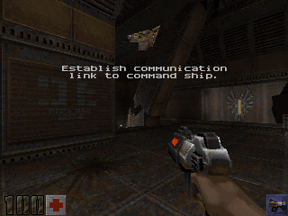
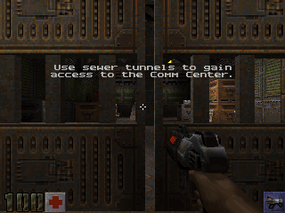

# Firebird Quake 2

 

Quake 2, simulated and rendered inside the [Firebird](https://firebirdsql.org) SQL database, running
entirely in your browser on Firebird 6 compiled to WebAssembly. The sequel to
[Firebird Quake](https://github.com/mariuz/firebird-quake), which grew out of
[Firebird DOOM](https://github.com/mariuz/firebird-doom); the next in the series is
[Firebird Quake III Arena](https://github.com/mariuz/firebird-quake3) ([play it](https://mariuz.github.io/firebird-quake3/)),
with Bézier patches, MD3 player models and deathmatch bots that think in SQL.

Every game tic is a PSQL procedure call. Every frame is a `SELECT`. JavaScript handles the keyboard,
the mouse and the canvas; everything else — collision against the BSP's brushes, the player's physics,
doors, platforms, rotating doors and fans, triggers and targets, items, the ten weapons, damage, the
monster AI, and the visibility and projection of every polygon on screen — happens in SQL.

```
keyboard/mouse → SELECT * FROM q2_tic(...)        game logic: 20 Hz, PSQL
               → SELECT * FROM frame_all(...)      the frame, in one result set: the visible polygons
                                                   (or every vertex projected, with texel coordinates),
                                                   the MD2 models and sprites in the PVS with their pose,
                                                   this frame's light animation, what to play and where
               → JS rasterises polygons and models through colormap.pcx → canvas
```

## Running it

```bash
npm install
npm run fetch-pak      # downloads the Quake 2 demo (q2-314-demo-x86.exe) and extracts baseq2/pak0.pak
npm test               # SQL smoke test in Node against the real Firebird WASM engine: the Outer Base
npm run test:base2     # the same on the Installation (demo2)
npm run test:base3     # and on demo3
npm run test:monsters  # every monster of the demo: spawned, it sees the player, attacks, and dies
npm run test:save      # save, play on, load: the game comes back exactly and keeps running
# in the page: ` opens the console (god, noclip, notarget, give …, use …, drop …, kill, map …, fov …, save, load); F1 the help computer
npm run serve          # http://localhost:8080/ — add -- --coi if your browser blocks service workers
npm run screenshots    # headless frames to docs/ (node scripts/screenshot.mjs demo1 --at=x,y,z,yaw)
npm run bench          # where a tic and a frame spend their time
npm run bench:tic      # the cost of a tic over 200 tics of play (median, p90); add --walk for a moving player
npm run bench:calls    # how many traces, leaf lookups and links a tic makes
npm run bench:ab -- <dir>  # A/B the SQL against another copy of sql/, tics alternating between two databases (--frame [--turn] for the frame)
npm run bench:raster   # where the painter spends its time (add --cold to rebuild every surface each frame)
npm run inspect        # what is in the pak (maps, models and their frame runs, sounds)
```

`fetch-pak` needs 7-Zip or `unzip` to open the demo's self-extracting archive. If you own Quake 2, point
the page at your own `pak0.pak` with the file picker, or copy it with `PAK=/path/to/pak0.pak npm run fetch-pak`:
the base unit's maps and monsters work the same way.

Firebird WASM uses pthreads, so the page must be cross-origin isolated. The dev server sends the
COOP/COEP headers with `--coi`; a static host like GitHub Pages cannot, so `coi-serviceworker.js`
re-issues responses with the headers after a one-time reload.

## How it works

The long version is [docs/ARCHITECTURE.md](docs/ARCHITECTURE.md): every table, procedure and pass, the
frame protocol, the painter, and the measurements behind the design. [docs/ROADMAP.md](docs/ROADMAP.md)
lists what is missing, from save games to the rest of the monsters. [CLAUDE.md](CLAUDE.md) is the
working memory for whoever (or whatever) works on this next: commands, how to measure, the engine's
rules learned the hard way.


### The BSP becomes tables (`sql/schema.sql`, `src/loader.js`)

A Quake 2 BSP (IBSP version 38) is a relational database in disguise, and more so than Quake's:
`loader.js` parses it (`src/bsp.js`) and copies it in, denormalised so the hot loops never need a
second lookup:

| table | from |
|---|---|
| `faces` | FACES + PLANES (flipped for `side`) + TEXINFO (the .wal name, the SURF_* flags), plus a bounding sphere |
| `face_verts` | EDGES and SURFEDGES resolved to an ordered vertex list per face |
| `nodes` | NODES with their plane copied in (children < 0 are leaves) |
| `leaves` | LEAVES with their cluster and area, and the cluster's PVS decompressed to a hex string |
| `leaffaces`, `leafbrushes` | the leaf → face and leaf → brush index arrays |
| `brushes`, `brushsides` | the collision volumes: contents, and each side's plane and surface flags |
| `models`, `anims` | the world, its submodels (`*N`), every `.md2` with its frame runs, the `.sp2` sprites |
| `map_ents` | the entity lump |

The WASM build binds parameters as text, so each table has a generated `LOAD_<table>` procedure that
parses 30 KB chunks of `|`-separated lines in PSQL. The Outer Base (90 k rows) loads in about three seconds.

### Collision is a recursive procedure (`sql/physics.sql`)

Quake 2 ships no clipnodes: a trace walks the node tree with the moving box's extents pushing each
split plane out (`CM_RecursiveHullCheck`) and, in every leaf it reaches, clips the segment against the
leaf's brushes whose contents match the mask (`CM_ClipBoxToBrush`). `RHC` is that walk as a recursive
PSQL procedure threading the trace state — fraction, hit plane, surface flags, contents, `allsolid`,
`startsolid` — through its parameters; `CLIP_LEAF` is the brush clipping. `TRACE_MOVE` runs it against
the world and against every brush-model entity at its own origin (rotating doors are traced in their own
rotated space, as `CM_TransformedBoxTrace` does), and clips against monsters and the player with a
Minkowski slab test, honouring `CONTENTS_MONSTER` / `CONTENTS_DEADMONSTER` so bullets hit corpses and
players walk through them. `FLY_MOVE`, `WALK_MOVE` (the 18-unit step), `MOVE_STEP` (monsters),
`TOSS_MOVE` and `PUSH_MOVE` (doors crushing and carrying, fans turning) are g_phys.c; the clip planes
and the pushed entities live in global temporary tables because PSQL has no arrays.

### The game is PSQL (`sql/game.sql`, `sql/weapons.sql`, `sql/monsters.sql`)

`Q2_TIC` runs the player (pmove.c: ducking, friction, acceleration, jumping, swimming, drowning, lava,
and the view's bob),
the pushers (doors and their teams, rotating doors, plats, buttons, trains with path corners, rotating
fans, timers), the thinks that are due, and the physics of everything that flies, bounces or falls.
Triggers (once, multiple, relay, always, counter, key, push, hurt) and targets (speaker, explosion,
splash, secret, goal, help, laser, changelevel with its `map$spawnpoint` and the intermission at a unit's end,
the unit's cross-level flags) are
g_trigger.c and g_target.c.
Items from stimpacks to the power shield, the ammo boxes, the keys and the timed powerups, with the
inventory they wait in (TAB, `[` `]`, ENTER, and Q, I, B, E for the powerups), are g_items.c and g_cmds.c; the blaster, shotgun, super shotgun, machinegun, chaingun, hand grenades, grenade and rocket
launchers, hyperblaster, railgun and BFG10K are p_weapon.c and g_weapon.c; armour, knockback, radius
damage and gibs are g_combat.c. The monsters run g_ai.c's state machine — `FIND_TARGET`,
`MOVE_TO_GOAL`, `NEW_CHASE_DIR`, `CHECK_ATTACK` — with the light, shotgun and machinegun guards, the
enforcer, gunner, berserker, flyer, parasite and tank defined in `monster_types`. Everything the
simulation wants heard is a row in `sound_events`; temp entities are rows in `fx_events`.

### The renderer is a query (`sql/render.sql`)

`FRAME_ALL` finds the leaf and cluster the eye is in and, once per cluster, marks every face of every
leaf whose cluster is in its PVS and whose area a closed door does not cut off into `vis_faces` (Quake's `visframe`), with each face's plane and
bounding sphere copied in. The frame is then a scan of that table with the back-face and frustum tests
as expressions, aggregated with `LIST()` into one row holding the visible face ids; each brush model in
the PVS (doors, plats, the fan — whether its clusters are visible is decided once per view cluster and
kept on its row) adds a row of its own faces at its origin. The same result set carries the MD2 models
and sprites in the PVS with their pose, the light styles, the new sounds and effects and the brush
models' poses, so a frame is one round trip to the engine. Two renderer modes are selectable in the
page: **SQL picks faces, JS projects** (the default) and **SQL projects every vertex** (`FRAME_FACES`:
one cursor joins the selected faces to their vertices and computes the rotation, the view transform,
the projection and the texel coordinates in the select list); both paint the same pixels
(`node scripts/screenshot.mjs demo1 --compare`). `FRAME_FACES_FAST` and `FRAME_ENTS` expose the face
and entity rows for scripts and the SQL console.

### JavaScript only paints (`src/renderer.js`)

An 8-bit framebuffer of palette indices and a z-buffer, like ref_soft. Polygons are scan-converted with
perspective-correct spans over a surface cache: the `.wal` tiled under the face's lightmap (the RGB
lightmap collapsed to its brightest channel, as `Mod_LoadLighting` did), run through `colormap.pcx`. As in
`D_DrawSpans16`, the texel coordinates are divided out every 16 pixels and stepped linearly between, the
mip level is chosen per surface as `D_MipLevelForScale` chose it (so far walls come from the smaller
images and don't shimmer), and a
surface is built the way `R_DrawSurfaceBlock8` did it: one row of light values interpolated per texel row,
stepped along it, so the painter spends about 1.5 ms on a 320×240 frame in Node and 3 ms when every surface
in view has to be rebuilt (a light style changed, a new area opened), down from 3 and 30; the 640×480 mode
costs about three times as much.
Translucent surfaces (`SURF_TRANS33/66`) are blended through the alpha map in the same picture; warping
surfaces ripple and flow, and with the eye under water the whole view wobbles as `D_WarpScreen` made it;
the sky is the `env/` cube map sampled by each pixel's direction. MD2 models
are lit as ref_soft lit them (the light under the model split into ambient and shade, the shade from a fixed
world direction by the vertex normals; items pulse, the gun never goes below a minimum), clipped
against the near plane triangle by triangle; sprites face the view; explosions are the fireball models
fading through their skins as `CL_AddExplosions` drew them; explosion debris, blood, blaster sparks
and the rail trail are particles. Muzzle flashes, rockets, blaster bolts, the BFG ball and explosions are
dynamic lights, added to the lightmaps of the faces they reach as ref_soft's `R_AddDynamicLights` did
(those faces are rebuilt for the frame) and to the models near them. The status bar comes from `pics/`.

Saved games: Escape brings up Quake 2's menus (`F2` save, `F3` load, `F10` quit), with fifteen slots and
an autosave as each map starts; `F6` quick-saves and `F9` quick-loads. A save is the four game tables (`game`, `player`, `ents`,
`lightstyles`) read out as rows and kept as JSON in the browser's `localStorage` (about 140 KB); a load
reloads the map's geometry and puts the rows back, remapping model ids by name and restarting the entity
id sequence above the highest saved id (`src/savegame.js`). It takes about a fifth of a second.

Sound: `sound_events` rows are played with the Web Audio API, attenuated and panned from where they
happened. The map's looped `target_speaker`s play at their origins and follow their on/off state in the
`ents` table; the entities' looped sounds (a bolt's or rocket's flight, a moving door, the railgun's hum)
are listed by each frame and follow the entities, and both are mixed per sound as `S_AddLoopSounds` mixed them. Quake 2's music was CD audio, not in the pak: put `track02.ogg`…`track11.ogg` (or `.mp3`)
in `public/music/`, or pick that folder in the page, and each map plays its `worldspawn` track;
without them a synthesised drone fills in.

## Firebird lessons

The ones from Firebird Quake still hold (join the marked set rather than `IN (subquery)`; arithmetic in
the select list is cheap, PSQL statements are not; rows are the cost; keep what does not change; bind as
text). New here:

- **Brush collision is more work than clipnodes, and most of the work is visiting leaves.** A player-sized
  box straddles many split planes, so the walk reaches dozens of leaves, nearly all of them empty. The
  `nodes` rows carry each leaf child's contents, so an empty leaf is skipped without a call, and the walk
  descends iteratively while the segment stays on one side, recursing only at a split. Each procedure
  call costs about 18 µs with 36 parameters, so calls are what to count.
- **Clip the whole segment in every leaf.** `CM_TraceToLeaf` clips the full trace, not the piece of it
  inside the leaf; clipping sub-segments made fractions incomparable and produced phantom hits at the start.
- **Arithmetic belongs in the select list; PSQL runs once per brush side.** The side's distances to both
  endpoints are expressions of the cursor, the loop only branches. An attempt to go further, one aggregate
  row per brush (`MAX`/`MIN` over the sides' enter and leave fractions from a grid of brushes), was
  slower: derived tables are inlined, so every reference to `d1` and `d2` re-evaluated the dot products.
- **Linking is the hidden cost of a move.** Every step relinks the entity to find its clusters for the
  PVS test; an entity that did not move is not relinked, and three point lookups serve instead of ten.
- **Idle rows should cost nothing.** Pushers that are not moving and have no think pending are skipped
  entirely; patrolling monsters out of the player's PVS think at 3 Hz and stride three times as far.
- **A frame whose view holds still is the last frame.** The world's visible-face list is kept on `viewcfg`
  with the eye position and view axes it was made for and reused while they hold, and so is the eye's leaf
  while only the view turns. The frustum tests themselves lost a third of their arithmetic: (c − e)·f is
  c·f − e·f, and e·f is a constant of the frame, not of the row. The entity row carries its model's kind
  and radius so the frame never joins `models`; the light-style list names only the styles that animate
  or that the map switches, the page holds the resting values. A brush model is tested against the frustum
  as a whole before its faces are, and its face list is kept on its row while the view holds and it does
  not move. An entity's clusters are three integer columns rather than a string, so the alias entities'
  PVS test is an expression of the cursor on the eye's leaf row, like the frustum tests: only the
  entities drawn reach PSQL at all. The frustum is four world-space planes, each a one-sided test that
  fails at the first plane a sphere is outside, instead of two `ABS` tests that each recomputed the depth;
  and a face whose plane has the eye's whole cluster behind it is left out when the cluster is marked,
  since no eye in the cluster can ever face it. Frame query, view held: 6.3 → 1.6 ms; turning: 3.5 → 1.9 ms.
  What is left of a turning frame is the scan of the cluster's front-facing faces, about 1.3 ms, which
  is the expression evaluator's floor: a leaf-level cull first would cost more in row fetches than it
  saves, in this engine.
- **Count the calls before timing the bodies.** A tic was making 43 tree descents, three per leaf
  lookup: a function in a `WHERE` clause (`WHERE l.id = point_leaf(…)`) is evaluated three times, for the
  index probe, the predicate and the fetch. Assigning it to a variable first made it one. And six
  exploding barrels and a dozen standing monsters were falling every tic: placed exactly on the floor,
  their first trace started in solid and never set the ground flag. Starting the drop a unit up, as
  `M_droptofloor` does, and treating a thing that cannot move at all as standing, removed 17 ms a tic.
- **An `UPDATE` of the wide `ents` row costs about 85 µs, as much as a trace step.** A monster's think
  wrote its next think time in one statement and its frame in another; now the think time rides along
  with whatever the think writes anyway. A step that stays in the same leaf keeps its cluster list
  instead of probing the box's corners again, and the step's position write carries the link position
  so the relink writes nothing. The player's water check runs only after a move, and writes the row
  only when the level changed; a map without water skips it altogether.
- **A function nested in a condition's expression runs twice.** `IF (f(x) = 1)` calls `f` once;
  `IF (BIN_AND(f(x), 56) <> 0)` calls it twice. The water check of every monster step walked the tree
  twice for that reason. Timing a procedure does not show this; counting its calls does.
- **The player's tic writes its two rows once.** Pitch, the jump latch, the view's step smoothing and the
  air timer used to be five writes of the player row and the yaw, the velocity and the ground flag three
  of the entity row, every tic, standing still or not; they are one write each now, and a player standing
  on the ground with no velocity does not move at all (the floor under them is re-checked twice a second
  rather than, as pmove does, every frame).
- **What nobody sees can think slowly.** A standing monster out of the player's PVS cannot see the player
  either, so it thinks at 3 Hz like a patrolling one does; a patrol out of sight strides four times as far
  at 2.5 Hz, with `SV_CloseEnough`'s stride-sized corner check so it does not overshoot its path corners;
  in sight everything is back to Quake's 10 Hz. A think also turns and aims in one write of the row (the
  wished yaw travels as a parameter instead of being written and read back) and tests the PVS on the leaf
  row itself rather than copying the 2 KB string into a variable first. Moving the tree walk's arithmetic into the node fetch's select list, on the
  other hand, changed nothing measurable: the fetch itself is the cost of a level, not the statements.
- **A row out of a procedure costs about 6 µs; a `LIST()` costs about 1 µs per element.** The frame used to
  be six queries returning some 600 rows (one per visible face), each row fetched through the WASM
  boundary; in the browser each query is a round trip to the engine's worker as well. Now the visible
  face ids travel as one ',' separated list per model, and faces, entities, light styles, sounds and
  effects come back from a single procedure as rows tagged with their kind. The marked faces carry their
  plane and sphere, so the scan needs no join, and whether a door's clusters are in the PVS is decided once
  per view cluster rather than parsed from strings every frame.

With all that, an idle tic on the Outer Base at hard skill (31 monsters, 14 of them patrolling) costs
about 3 ms in Node (about 5.5 with the player walking), down from 40 at first and 20 after the first round;
the frame's query 1.9 ms turning and 1.6 ms with the view held, down from about 18 for the six queries it began as.

## Licence

MIT for the code here. Firebird and Electric Firebird are Apache-2.0. The Quake 2 demo is freely
redistributable; Quake 2 is a trademark of id Software.
